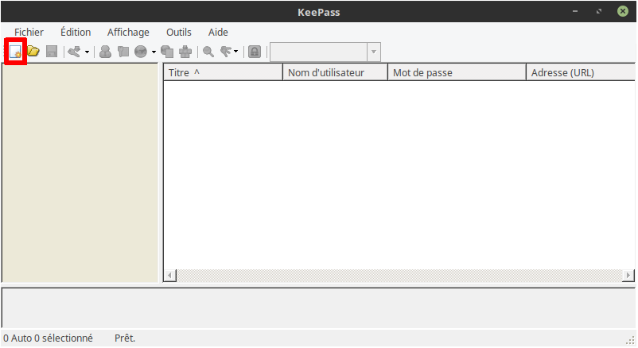
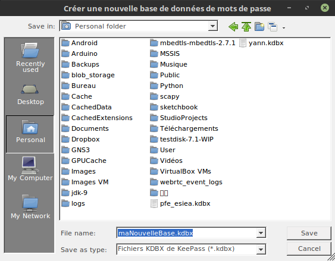
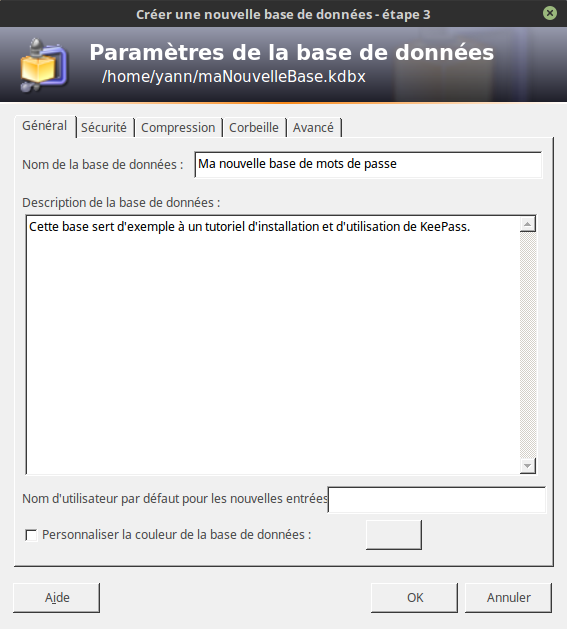
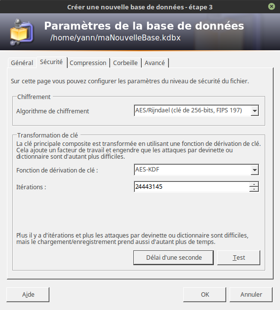
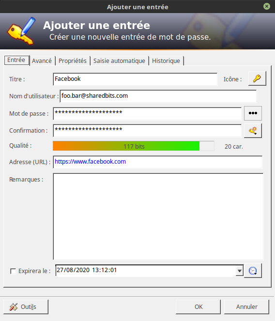
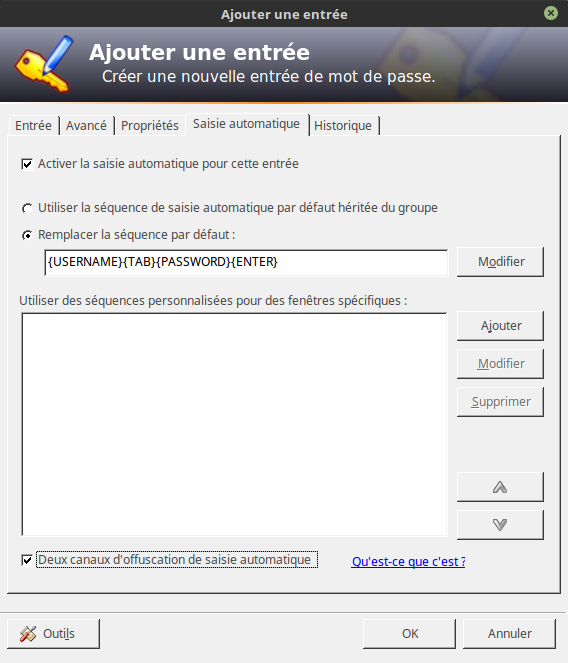
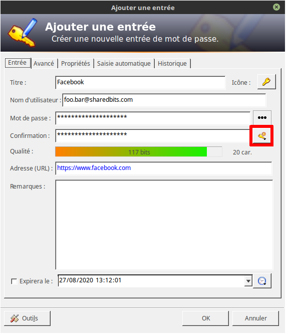
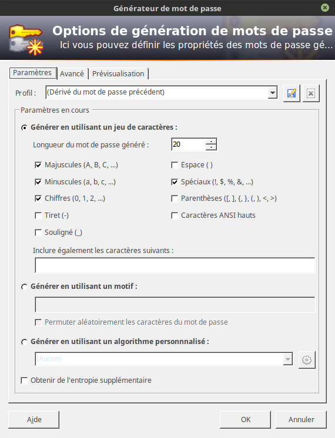

# How to - KeePass

- [How to - KeePass](#how-to---keepass)
  - [Présentation du logiciel](#présentation-du-logiciel)
  - [Installation](#installation)
    - [Pour Windows](#pour-windows)
    - [Installation du pack de langue français](#installation-du-pack-de-langue-français)
  - [Utilisation](#utilisation)
    - [Créer une base de données](#créer-une-base-de-données)
    - [Créer une nouvelle entrée dans la base de donnée](#créer-une-nouvelle-entrée-dans-la-base-de-donnée)
    - [Utiliser une entrée existante](#utiliser-une-entrée-existante)
    - [Utiliser le générateur de mot de passe](#utiliser-le-générateur-de-mot-de-passe)

## Présentation du logiciel

[KeePass][website] est un logiciel dit "gestionnaire de mots de passe". Sa fonction est de sauvegarder dans un fichier de base de donnée, tous vos mots de passe. Cette base de donnée est bien évidemment chiffrée pour garantir la confidentialité des informations qui y sont contenues.  
D'autres logiciels gestionnaires de mots de passe existent, mais je n'ai pas eu l'occasion de les tester personnellement ([1Password][1password], [LastPass][lastpass], ...). [KeePass][website] est un bon choix pour la gestion de vos mots de passe puisque recommandé par l'[ANSSI][anssi].

## Installation

### Pour Windows

Le logiciel peut être téléchargé depuis le site de KeePass, rubrique [Downloads](https://keepass.info/download.html). Veuillez à bien sélectionner la version 2.x.y, dernière version disponible et maintenue à jour.  
L'installation du logiciel se déroule de façon classique.

### Installation du pack de langue français

Les packs de langue se trouvent sur la page [Translations](https://keepass.info/translations.html). Choisissez le pack français correspondant à la version téléchargée et installée de KeePass.  
Une fois le pack téléchargé, ouvrez le logiciel, et allez à "Display > Change Language...". Sur la partie inférieure gauche de la fenêtre nouvellement ouverte, cliquez sur "Open Folder". L'explorateur Windows s'ouvre dans le dossier permettant de stocker les différents packs de langue. Copiez le pack de langue français téléchargé à cet emplacement.  
Relancez le logiciel, et re-sélectionnez "Display > Change Language..." : le français est maintenant disponible.

## Utilisation

### Créer une base de données

1. Après avoir ouvert le logiciel, sélectionner l'icône pour créer une nouvelle base de données, ou saisissez le raccourci `Ctrl + N`, ou sélectionner "Fichier > Nouvelle...". 
1. A l'écran suivant, sélectionnez l'emplacement pour votre future nouvelle base de données, ainsi que son nom. 
1. A l'écran suivant, il vous est demandé de saisir le mot de passe principal de votre base. Ce mot de passe est celui qui protégera tous vos autres mots de passe. Il est important de bien le choisir. Quelques conseils :
   1. Un mot de passe robuste se définit essentiellement sur sa longueur, et non pas sur la richesse du dictionnaire utilisé
   1. Introduire malgré tout quelques caractères spéciaux ou chiffres en substitution de certaines lettres normales améliorera également la robustesse de votre mot de passe (code 1337)
   1. On se souvient beaucoup plus facilement d'un mot de passe qui nous touche personnellement qu'une série apparemment aléatoire de caractères
   1. Le logiciel vous donne une estimation de la complexité de votre mot de passe en bits. Un mot de passe est actuellement considéré comme solide si sa complexité dépasse les 80 bits.
   1. Exemple de bons mot de passe :
      * Jen'4imep4sDUTOUTlesc00kies!!
      * Ilmeparletoutbas,Jev01slaVIEenr0se
      * LaSNCFn'3stJAMAISenr3tard...
1. Une fois votre mot de passe choisi et validé, l'écran suivant vous propose plusieurs éléments. Nous allons ici passer en revue uniquement les onglets dignes d'intérêt, libre à vous d'explorer les autres options
   1. Onglet "Général" : saisissez le nom que vous souhaitez donner à votre base. 
   1. Onglet "Sécurité" : c'est le plus important dans la création de votre base de données. Sa robustesse dépendra des paramètres que vous saisirez ici.
      1. Algorithme de chiffrement : choisir "AES/Rijndael (clé de 256-bits, FIPS 197)"
      1. Fonction de dérivation de clé : "AES-KDF"
      1. Pour définir le nombre d'itérations, cliquez sur le bouton "Délai d'une seconde" en bas de la fenêtre 

Votre nouvelle base de données est maintenant créée et prête à l'emploi. Pensez à la sauvegarder tout de suite (`Ctrl + S`) !

### Créer une nouvelle entrée dans la base de donnée

1. Pour créer une nouvelle entrée, cliquez sur l'icône en forme de clé à la droite de l'icône de sauvegarde, ou faites `Ctrl + I`
1. Sur le nouvel écran, de nombreuses options vous sont proposées. Passons en revue les plus utiles
   1. Onglet "Entrée"
      * Titre : le nom de l'entrée. Pour Facebook par exemple, un bon titre est... "Facebook"
      * Nom d'utilisateur : le nom d'utilisateur normalement utilisé dans le champ "Login"/"ID"/"Identifiant" du site ou du service souhaité
      * Mot de passe : vous pouvez saisir un mot de passe et sa confirmation, ou utiliser le générateur de mots de passe (voir [Utiliser le générateur de mot de passe](#utiliser-le-g%c3%a9n%c3%a9rateur-de-mot-de-passe)). Le bouton à 3 points au bout de la ligne de mot de passe vous permet de révéler le mot de passe saisi.
      * Adresse (URL) : lien vers le site/service choisi
      * Expirera le : si vous souhaitez définir un rappel pour changer le mot de passe au bout d'un certain temps 
    1. Onglet "Saisie automatique" : cet onglet vous permet de définir ce qui devra être saisi dans les champs appropriés du site/service voulu en paramétrant une séquence de saisie au clavier. Par exemple, le site de Facebook demande de remplir 2 champs : identifiant et mot de passe. La figure suivant montre comment paramétrer la séquence pour que ces champs des remplissent automatiquement. Pour utiliser la saisie automatique sur le site de Facebook, cliquer dans le chap "Identifiant" (le curseur doit clignoter dans ce champ), retournez sur KeePass, sélectionnez l'entrée "Facebook" et utiliser le raccourci `Ctrl + V`. Le focus reviendra sur la page Facebook et les caractères seront saisis. Vous pouvez également utiliser l'option "Deux canaux d'obfuscation" en base de la fenêtre pour induire de la confusion chez un éventuel attaquant. 
1. Une fois votre nouvelle entrée correctement paramétrée, validez en cliquant sur "OK" et **sauvegardez votre base de données**.

### Utiliser une entrée existante

* Si vous avez paramétré la saisie automatique pour l'entrée, il vous suffit de sélectionner le premier champ à remplir sur le site/service souhaité, et d'utiliser le raccourci `Ctrl + V` 
* Si la saisie automatique n'est pas configurée, il vous faudra copier/coller identifiant et mot de passe. Pour ce faire, double-cliquez sur l'identifiant ou le mot de passe de l'entrée voulue : celui-ci se retrouve alors placé dans le presse-papier de votre ordinateur pour 12 secondes. Cela vous laisse le temps de le coller dans le champ correspondant du site/service voulu.

### Utiliser le générateur de mot de passe

Voici peut-être l'outil le plus utile de KeePass. Celui-ci vous permet, avec un choix de paramètre, de générere automatiquement des mots de passe robustes. Couplé à la gestion de la base de données, vous n'aurez plus à retenir une myriade de mots de passe, ou pire, utiliser le même mot de passe sur différents services.  
Pour commencer, dans l'onglet "Entrée" d'une entrée, ouvrez le générateur de mot de passe   
Nous ne nous concentrerons ici que sur l'onglet "Paramètres" du générateur. Vous êtes libre d'explorer les autres options. Sur cet écran, définissez les paramètres de complexité que vous souhaitez pour votre mot de passe. Ces paramètres seront respectés par le générateur. _Le jeu de paramètres que j'utilise le plus souvent est celui montré sur la capture d'écran suivante._ .  
Une fois vos paramètres choisis, cliquez simplement sur "OK" pour qu'un mot de passe y correspondant soit généré et saisi dans le champ mot de passe de l'entrée.

[website]: https://keepass.info
[1password]: https://1password.com/
[lastpass]: https://www.lastpass.com/fr
[anssi]: https://www.ssi.gouv.fr/